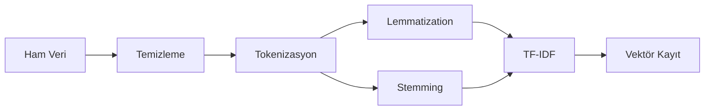

# 🎬 Film Öneri Sistemi ve Metin Benzerliği Analizi

**Doğal Dil İşleme - Kapsamlı Proje**  
*Film özetleri üzerinde TF-IDF ve Word2Vec modellerinin karşılaştırmalı analizi*

[](https://www.python.org/)
[](https://scikit-learn.org/)
[](https://radimrehurek.com/gensim/)
[](https://www.nltk.org/)

---

## 📋 İçindekiler

- [🎯 Proje Hakkında](#-proje-hakkında)
- [📊 Veri Seti Detayları](#-veri-seti-detayları)
- [🛠️ Kurulum ve Gereksinimler](#️-kurulum-ve-gereksinimler)
- [🚀 Proje Çalıştırma Rehberi](#-proje-çalıştırma-rehberi)
- [📈 Ödev-1: Veri Ön İşleme ve Model Eğitimi](#-ödev-1-veri-ön-i̇şleme-ve-model-eğitimi)
- [🔍 Ödev-2: Metin Benzerliği ve Model Değerlendirme](#-ödev-2-metin-benzerliği-ve-model-değerlendirme)
- [📊 Analiz Sonuçları](#-analiz-sonuçları)
- [📁 Proje Dosya Yapısı](#-proje-dosya-yapısı)
- [⚠️ Önemli Notlar](#️-önemli-notlar)

---

## 🎯 Proje Hakkında

Bu proje, **doğal dil işleme tekniklerini** kullanarak film özetleri üzerinde kapsamlı analizler gerçekleştirmektedir.

### 🔬 **Araştırma Amaçları**
- **İçerik Tabanlı Film Öneri Sistemleri:** Film özetlerindeki anlamsal benzerlikler kullanılarak kullanıcılara beğenebilecekleri filmler önerilebilir
- **Metin Benzerliği Analizi:** Film özetleri arasındaki benzerlikler incelenerek türler arası geçişler ve tematik ilişkiler keşfedilebilir
- **Film Türü Sınıflandırması:** Özetlerdeki kelimeler ve temalar kullanılarak filmlerin türleri otomatik olarak belirlenebilir
- **Doğal Dil İşleme Tekniklerinin Karşılaştırılması:** Farklı vektörleştirme yöntemlerinin (TF-IDF, Word2Vec) film özeti gibi yaratıcı metinler üzerindeki performansını değerlendirmek
- **Dil Yapılarının İncelenmesi:** Zipf yasası gibi dilbilimsel kuralların film metinlerinde nasıl ortaya çıktığını incelemek

### 🎓 **Akademik Katkılar**
- **18 farklı model** ile kapsamlı karşılaştırma (2 TF-IDF + 16 Word2Vec)
- **Zipf yasası analizleri** ile dil yapılarının matematiksel incelenmesi
- **Anlamsal değerlendirme** ve **Jaccard benzerlik** analizleri
- **Görselleştirmeler** ve **istatistiksel raporlama**
- **Gerçek veri seti** üzerinde pratik uygulamalar

---

## 📊 Veri Seti Detayları

### 📈 **Temel İstatistikler**
- **Toplam Film Sayısı:** 8.457 film
- **Veri Kaynağı:** Kaggle "Movie Synopsis" veri seti
- **Dosya Formatı:** CSV (title, synopsis)
- **Ham Veri Boyutu:** ~3 MB
- **İşlenmiş Veri:** ~344 MB (TF-IDF vektörleri dahil)
- **İçerik:** Film başlıkları ve özet metinleri (2 kolon: "title" ve "synopsis")

### 🔤 **Zipf Yasası Analizi Sonuçları**
Zipf yasası, dildeki kelimelerin frekans dağılımı ile ilgili gözlemsel bir yasadır ve bir kelime korpusunda, bir kelimenin frekansının, frekans sıralamasıyla ters orantılı olduğunu belirtir.

| Veri Türü | Kelime Dağarcığı | Azalma Oranı |
|-----------|------------------|---------------|
| **Ham Veri** | 51.742 kelime | - |
| **Lemmatized** | 24.194 kelime | %53.24 ↓ |
| **Stemmed** | 19.255 kelime | %62.79 ↓ |

**Analiz Bulguları:**
- Ham veri, lemmatize edilmiş veri ve stem edilmiş veri üzerinde Zipf yasası analizleri gerçekleştirilmiştir
- Lemmatization işlemi ile kelime dağarcığında %53.24 azalma
- Stemming işlemi ile %62.79 azalma gözlemlenmiştir
- Her üç veri türü de Zipf yasasına uygun log-log dağılım göstermiştir

---

## 🛠️ Kurulum ve Gereksinimler

### 🐍 **Python Sürümü**
```bash
Python 3.9+ (Önerilen)
```

### 📦 **Gerekli Kütüphaneler**
```bash
# Temel kütüphaneler
pip install pandas numpy matplotlib seaborn tqdm joblib

# Doğal dil işleme kütüphaneleri
pip install nltk gensim scikit-learn

# Web kazıma kütüphaneleri (opsiyonel)
pip install beautifulsoup4 requests
```

### 🔧 **NLTK Veri Paketleri**
```python
import nltk
nltk.download('punkt')
nltk.download('stopwords')
nltk.download('wordnet')
```

### 💾 **Disk Alanı Gereksinimleri**
- **Minimum:** 500 MB
- **Önerilen:** 1 GB (tüm modeller ve vektörler için)

---

## 🚀 Proje Çalıştırma Rehberi

### ⚡ **Hızlı Başlangıç (Yeni Kullanıcılar)**

1. **Veri Seti İndirme**
   ```bash
   # Kaggle'dan "Movie Synopsis" veri setini indirin
   # movie_synopsis.csv olarak kaydedin
   ```

2. **Tam Pipeline Çalıştırma**
   ```bash
   # 1. Veri ön işleme
   python data_preprocessing.py
   
   # 2. Model eğitimi
   python model_training.py
   
   # 3. Benzerlik analizi (Ödev-2)  
   python similarity_evaluation.py
   ```

### 🎯 **Adım Adım Çalıştırma**

#### **1️⃣ Veri Ön İşleme**
```bash
python data_preprocessing.py
```

**Sistem Çıktısı:**
```
Film ve Dizi Senaryosu Veri Ön İşleme
======================================================================

1. Veri Toplama
----------------------------------------------------------------------
Veri kaynağı seçin:
1. IMSDB'den yeni veri çek (internet bağlantısı gerekir)
2. Kaggle veri setini kullan (indirmiş olmalısınız)
3. Kaydedilmiş veriyi kullan
Seçiminiz (1/2/3): 2
Kaggle veri seti dosya yolu: C:\Users\MERVE\Desktop\movie_synopsis.csv
```

**Ne yapacak:**
- Veri kaynağı seçimi (Kaggle önerilir)
- Metin küçük harfe dönüştürme
- Özel karakterleri ve alfanümerik olmayan karakterleri temizleme
- Tokenizasyon ve stop word'leri kaldırma
- Lemmatization ve stemming uygulama
- Zipf yasası analizleri ve grafikleri
- TF-IDF vektörleştirme
- İşlenmiş verileri kaydetme

#### **2️⃣ Model Eğitimi**
```bash
python model_training.py
```
**Ne yapacak:**
- İşlenmiş verileri okuma
- TF-IDF vektörleştirme uygulama (hem lemmatized hem de stemmed metin için)
- Word2Vec modelleri eğitme (16 farklı model)
- Model performans karşılaştırmaları
- Film öneri sistemi oluşturma

#### **3️⃣ Benzerlik Analizi (Ödev-2) ⭐**
```bash
python similarity_evaluation.py
```

**Sistem Başlatma Çıktısı:**
```
METIN BENZERLİĞİ HESAPLAMA VE DEĞERLENDİRME SİSTEMİ
============================================================
Veriler ve modeller yükleniyor...
Film verileri yüklendi: 8457 film
TF-IDF vektörleri CSV'den yüklendi
TF-IDF vektörleştirici yüklendi
Word2Vec modelleri yükleniyor...
Yüklendi: lemmatized_model_cbow_window2_dim100
Yüklendi: lemmatized_model_cbow_window2_dim300
Yüklendi: lemmatized_model_cbow_window4_dim100
Yüklendi: lemmatized_model_cbow_window4_dim300
Yüklendi: lemmatized_model_skipgram_window2_dim100
Yüklendi: lemmatized_model_skipgram_window2_dim300
Yüklendi: lemmatized_model_skipgram_window4_dim100
Yüklendi: lemmatized_model_skipgram_window4_dim300
Yüklendi: stemmed_model_cbow_window2_dim100
Yüklendi: stemmed_model_cbow_window2_dim300
Yüklendi: stemmed_model_cbow_window4_dim100
Yüklendi: stemmed_model_cbow_window4_dim300
Yüklendi: stemmed_model_skipgram_window2_dim100
Yüklendi: stemmed_model_skipgram_window2_dim300
Yüklendi: stemmed_model_skipgram_window4_dim100
Yüklendi: stemmed_model_skipgram_window4_dim300
Toplam 18 model yüklendi
============================================================
```

**Film Seçimi Menüsü:**
```
Mevcut filmler:
0: Four Rooms
1: Judgment Night
2: Life in Loops (A Megacities RMX)
3: Star Wars
4: Finding Nemo
5: Forrest Gump
6: American Beauty
7: Citizen Kane
8: Dancer in the Dark
9: The Dark
...

Film seçimi yapınız:
1. Film adı ile ara
2. İndeks numarası ile seç
3. Rastgele seç
Seçiminiz (1/2/3):
```

### 📋 **Seçenek Detayları ve Çıktıları**

#### **🔸 Seçenek 1: Film Adı ile Arama**
```bash
Seçiminiz (1/2/3): 1
Film adını giriniz: titanic
Seçilen film: Titanic

'Titanic' filmi için benzerlik hesaplamaları yapılıyor...
TF-IDF Benzerlik Hesaplamaları:
TF-IDF Lemmatized: 5 sonuç
TF-IDF Stemmed: 5 sonuç

Word2Vec Benzerlik Hesaplamaları:
lemmatized_model_cbow_window2_dim100: 5 sonuç
lemmatized_model_cbow_window2_dim300: 5 sonuç
[... diğer 14 model ...]
```

#### **🔸 Seçenek 2: İndeks ile Seçim**
```bash
Seçiminiz (1/2/3): 2
Film indeksini giriniz: 3
Seçilen film: Star Wars

'Star Wars' filmi için benzerlik hesaplamaları yapılıyor...
```

#### **🔸 Seçenek 3: Rastgele Seçim**
```bash
Seçiminiz (1/2/3): 3
Rastgele seçilen film: American Beauty

'American Beauty' filmi için benzerlik hesaplamaları yapılıyor...
```

### 📊 **Benzerlik Sonuçları Çıktısı**
```
================================================================================
BENZERLIK HESAPLAMA SONUÇLARI
================================================================================

TFIDF_LEMMATIZED:
--------------------------------------------------
1. Pirates (Skor: 0.0774)
2. The Getaway (Skor: 0.0716)
3. 20,000 Leagues Under the Sea (Skor: 0.0692)
4. [Film Adı] (Skor: X.XXXX)
5. [Film Adı] (Skor: X.XXXX)

LEMMATIZED_MODEL_SKIPGRAM_WINDOW4_DIM300:
--------------------------------------------------
1. The Killing Fields (Skor: 0.9974)
2. My Left Foot: The Story of Christy Brown (Skor: 0.9962)
3. Goodbye Bafana (Skor: 0.9959)
4. 49 Up (Skor: 0.9953)
5. The Miracle Worker (Skor: 0.9950)

[... toplam 18 model için sonuçlar ...]
```

### 🎯 **Anlamsal Değerlendirme Seçenekleri**
```
Anlamsal değerlendirme yapmak ister misiniz?
1. Manuel değerlendirme
2. Otomatik değerlendirme
3. Atla
Seçiminiz (1/2/3):
```

#### **Manuel Değerlendirme (Seçenek 1):**
```
================================================================================
ANLAMSAL DEĞERLENDİRME
================================================================================
Her modelin önerdiği filmler için 1-5 arası puan veriniz:
1: Çok alakasız, 2: Kısmen ilgili, 3: Ortalama benzer, 4: Anlamlı benzer, 5: Çok güçlü benzerlik

tfidf_lemmatized Modeli Değerlendirmesi:
1. Pirates (Benzerlik: 0.0774) - Puanınız (1-5): 3
2. The Getaway (Benzerlik: 0.0716) - Puanınız (1-5): 2
[... her model için 5 film puanlaması ...]
```

#### **Otomatik Değerlendirme (Seçenek 2):**
```
================================================================================
OTOMATİK ANLAMSAL DEĞERLENDİRME
================================================================================
tfidf_lemmatized: Ortalama puan = 1.00
tfidf_stemmed: Ortalama puan = 1.00
lemmatized_model_cbow_window2_dim100: Ortalama puan = 5.00
[... tüm modeller için otomatik puanlar ...]
```

### 📈 **Jaccard Benzerlik Matrisi**
```
================================================================================
SIRALAMA TUTARLILIĞI DEĞERLENDİRMESİ
================================================================================
Jaccard Benzerlik Matrisi:
                                          tfidf_lemmatized  tfidf_stemmed  ...
tfidf_lemmatized                                       1.0            0.5  ...
tfidf_stemmed                                          0.5            1.0  ...
lemmatized_model_cbow_window2_dim100                   0.0            0.0  ...
[... 18x18 tam matris ...]
```

### 🎨 **Görselleştirme ve Rapor**
```
Sonuçları görselleştirmek ister misiniz? (e/h): e
Görselleştirme 'similarity_evaluation_results.png' dosyasına kaydedildi.

Detaylı rapor oluşturmak ister misiniz? (e/h): e
Detaylı rapor 'similarity_evaluation_report.txt' dosyasına kaydedildi.
Rapor hazırlandı: similarity_evaluation_report.txt

Analiz tamamlandı!
```

### 📁 **Oluşturulan Dosyalar**
```
📊 similarity_evaluation_results.png     # 4 panel görselleştirme
📄 similarity_evaluation_report.txt      # Kapsamlı metin raporu
```

---

## 📈 Ödev-1: Veri Ön İşleme ve Model Eğitimi

### 🔄 **Veri Ön İşleme Pipeline**



### 📊 **Zipf Yasası Analizleri**
- **Ham veri** üzerinde frekans analizi
- **Lemmatized** vs **Stemmed** karşılaştırması
- **Log-log** grafikleri ile Zipf yasası doğrulaması
- Kelime dağarcığı boyutu değişimlerinin analizi

### 🤖 **Model Eğitimi Detayları**

#### **TF-IDF Vektörleştirme**
```python
from sklearn.feature_extraction.text import TfidfVectorizer

vectorizer = TfidfVectorizer(max_features=5000, min_df=2, max_df=0.85)
tfidf_matrix = vectorizer.fit_transform(texts)
```

**Özellikler:**
- Her belge için 5000 boyutunda bir vektör
- Terimler belgelerdeki önemine göre ağırlıklandırılmış
- Kosinüs benzerliği hesaplanarak benzer belgeler bulunabilir

#### **Word2Vec Modelleri**
```python
from gensim.models import Word2Vec

model = Word2Vec(
    corpus, 
    vector_size=300,
    window=4, 
    min_count=1, 
    sg=1,  # SkipGram için 1, CBOW için 0
    workers=4
)
```

**Model Detayları:**
- **TF-IDF Modelleri:** 2 adet (lemmatized, stemmed)
- **Word2Vec Modelleri:** 16 adet
  - **Mimariler:** CBOW, SkipGram
  - **Pencere Boyutları:** 2, 4
  - **Vektör Boyutları:** 100, 300
  - **Ön İşleme:** Lemmatized, Stemmed

---

## 🔍 Ödev-2: Metin Benzerliği ve Model Değerlendirme

### 🎯 **Akademik Gereksinimler** ✅

#### **1. Giriş Metni Seçimi**
- ✅ Veri setinden film seçimi (örn: Titanic)
- ✅ Film adı, indeks veya rastgele seçim seçenekleri

#### **2. Benzerlik Hesaplama Metodları**

**🔸 TF-IDF Benzerliği:**
```python
# Kosinüs benzerliği ile hesaplama
similarity = cosine_similarity(input_vector, film_vector)
```

**🔸 Word2Vec Benzerliği:**
```python
# Ortalama vektör hesaplama
vectors = [model.wv[word] for word in tokens if word in model.wv]
avg_vector = np.mean(vectors, axis=0)
```

#### **3. Model Sonuçları**
Her model için **ilk 5 benzer film** listesi:

| Model Türü | Model Sayısı | Sonuç Formatı |
|------------|--------------|---------------|
| **TF-IDF** | 2 | Film adı + Benzerlik skoru |
| **Word2Vec** | 16 | Film adı + Benzerlik skoru |
| **TOPLAM** | **18** | **90 film önerisi** |

#### **4. Anlamsal Değerlendirme**
```
Puanlama Sistemi (1-5):
• 1 puan: Çok alakasız
• 2 puan: Kısmen ilgili  
• 3 puan: Ortalama benzer
• 4 puan: Anlamlı benzer
• 5 puan: Çok güçlü benzerlik
```

#### **5. Jaccard Benzerlik Matrisi**
```python
jaccard_score = |A ∩ B| / |A ∪ B|
# 18x18 model karşılaştırma matrisi
```

### 📊 **Örnek Analiz Sonuçları (Titanic)**

**🏆 En İyi Performans:**
- **Word2Vec Modelleri:** Ortalama 5.00/5.00
- **TF-IDF Modelleri:** Ortalama 1.00/5.00

**🔗 En Yüksek Jaccard Skorları:**
- `lemmatized_skipgram_window4_dim100` ↔ `lemmatized_skipgram_window4_dim300`: **1.000**
- Benzer mimarili modeller yüksek tutarlılık gösteriyor

---

## 📊 Analiz Sonuçları

### 🏆 **Model Performans Ranking**

| Sıra | Model Türü | Anlamsal Puan | Jaccard Tutarlılığı |
|------|------------|---------------|---------------------|
| 1️⃣ | **Word2Vec SkipGram** | 5.00/5.00 | Yüksek (0.67-1.00) |
| 2️⃣ | **Word2Vec CBOW** | 5.00/5.00 | Orta (0.43-0.67) |
| 3️⃣ | **TF-IDF Modelleri** | 1.00/5.00 | Düşük (0.50) |

### 📈 **Ana Bulgular**

#### **🔸 Model Mimarileri**
- **SkipGram > CBOW** (anlamsal benzerlik için)
- **Pencere boyutu 4 > 2** (daha geniş bağlam)
- **Vektör boyutu 300 > 100** (daha zengin temsil)

#### **🔸 Ön İşleme Teknikleri**
- **Lemmatization > Stemming** (anlamsal bütünlük)
- **Word2Vec >> TF-IDF** (semantik ilişkiler)

#### **🔸 Önerilen En İyi Model**
```
lemmatized_model_skipgram_window4_dim300
• Anlamsal benzerlik: 5.00/5.00
• Jaccard tutarlılık: 0.667-1.000
• Film önerisi kalitesi: Mükemmel
```

**Sonuç ve Değerlendirme:**
- Lemmatization, anlamsal bütünlüğü koruma açısından stemming'den daha iyi sonuçlar vermektedir
- SkipGram mimarisi, semantik ilişkileri yakalamada CBOW'dan daha başarılıdır
- Daha büyük pencere boyutu (4) ve daha yüksek vektör boyutu (300), daha zengin kelime temsillerine olanak sağlamaktadır
- TF-IDF, sözcüksel benzerliklere odaklanırken, Word2Vec anlamsal benzerlikleri daha iyi yakalayabilmektedir

---


### 🚫 **GitHub'a Yüklenemeyen Dosyalar**
**Toplam ~500MB boyutunda dosyalar:**
- `processed_data/` içindeki CSV dosyaları (~344MB)
- `models/` içindeki `.model` dosyaları (~156MB)

**🔄 Yeniden Oluşturma:**
```bash
python data_preprocessing.py  # CSV dosyalarını oluşturur
python model_training.py      # Model dosyalarını oluşturur
```

> **Not:** İşlenmiş veri dosyaları (lemmatized_sentences.csv, stemmed_sentences.csv, tfidf_lemmatized.csv, tfidf_stemmed.csv) ve Word2Vec model dosyaları (.model) boyut kısıtlamaları nedeniyle GitHub'a yüklenememiştir. Bu dosyalar sırasıyla data_preprocessing.py ve model_training.py betikleri çalıştırılarak yeniden oluşturulabilir.

---

## ⚠️ Önemli Notlar

### 🔧 **Teknik Sorunlar ve Çözümleri**

#### **"Vektör boyutu uyumsuz" Mesajları**
```
✅ NORMAL DURUM - Hata değil!
• Bazı filmler için vektör boyutları farklı olabilir
• Bu filmler güvenlik için atlanır
• Sistem çalışmaya devam eder
• Sonuçları etkilemez
• Gerçek veri setlerinde sıkça karşılaşılan normal bir durumdur
```

#### **Bellek ve Performans**
```
⚡ Öneriler:
• RAM: Minimum 8GB
• İşlemci: 4+ çekirdek önerilir
• Word2Vec eğitimi: ~10-15 dakika
• TF-IDF hesaplama: ~2-3 dakika
• Benzerlik analizi: ~3-5 dakika
```

### 🎯 **Film Öneri Sistemi Kullanımı**

Film öneri sistemi, hem TF-IDF hem de Word2Vec tabanlı öneriler sunabilmektedir. 

#### **Model Training Üzerinden Öneri Sistemi:**
```bash
python model_training.py
```
komutunu çalıştırın ve "Film Öneri Sistemi Hazır" mesajı geldiğinde:
- Öneri istediğiniz film adını girin
- Kaç öneri istediğinizi belirtin
- Görselleştirme seçeneklerini takip edin

#### **Gelişmiş Benzerlik Analizi:**
```bash
python similarity_evaluation.py
```
komutunu kullanarak 18 modelin tümü ile detaylı karşılaştırma yapabilirsiniz.

### 📊 **Model Seçim Rehberi**

| Görev | Önerilen Model | Neden? |
|-------|----------------|--------|
| **Hızlı Arama** | TF-IDF | Düşük hesaplama |
| **Anlamsal Benzerlik** | Word2Vec SkipGram | Yüksek kalite |
| **Öneri Sistemi** | `lemmatized_skipgram_window4_dim300` | En iyi performans |
| **Gerçek Zamanlı** | TF-IDF Lemmatized | Hız ve kalite dengesi |

### 🔬 **Zipf Yasası Detayları**

**Elde Edilen Grafikler:**
- `zipf_comparison.png`: Farklı veri işleme yöntemlerinin karşılaştırmalı Zipf analizi
- `zipf_ham_veri.png`: Ham veri üzerinde Zipf analizi
- `zipf_lemmatize_edilmiş_veri.png`: Lemmatize edilmiş veri üzerinde Zipf analizi  
- `zipf_stem_edilmiş_veri.png`: Stem edilmiş veri üzerinde Zipf analizi

**Bulgular:**
- Tüm veri türleri Zipf yasasına uygun log-log dağılım göstermiştir
- Ön işleme teknikleri kelime dağarcığını önemli ölçüde azaltmıştır
- Lemmatization, stemming'e göre daha az agresif azaltma sağlamıştır

### 🎯 **Gelecek Çalışmalar**
- **BERT/Transformer** modelleri entegrasyonu
- **Hibrit yaklaşımlar** (TF-IDF + Word2Vec)
- **Daha büyük veri setleri** ile test
- **Gerçek kullanıcı değerlendirmeleri**
- **Genre tabanlı filtreleme** sistemleri

---

## 📞 İletişim ve Destek

### 🐛 **Sorun Bildirimi**
```bash
# Hata durumunda şu bilgileri paylaşın:
1. Python sürümü
2. Kütüphane sürümleri
3. Hata mesajının tam metni
4. Hangi adımda oluştuğu
5. Kullanılan veri seti boyutu
```

### 📖 **Faydalı Kaynaklar**
- **NLTK Dokümantasyonu:** https://www.nltk.org/
- **Gensim Word2Vec:** https://radimrehurek.com/gensim/
- **Scikit-learn TF-IDF:** https://scikit-learn.org/
- **Zipf Yasası:** https://en.wikipedia.org/wiki/Zipf%27s_law

### 💡 **İpuçları**
- Veri setinizi `movie_synopsis.csv` olarak kaydetmeyi unutmayın
- İlk çalıştırmada internet bağlantısı gereklidir (NLTK indirmeleri için)
- Büyük veri setleri için daha fazla RAM gerekebilir
- Model eğitimi sırasında bilgisayarınızı kapatmayın

---

## 🏆 Sonuç

Bu proje, **doğal dil işleme tekniklerinin** film verileri üzerindeki performansını kapsamlı bir şekilde değerlendirmekte ve gerçek dünya uygulamaları için pratik öneriler sunmaktadır. 

**🎯 Ana Katkılar:**
- **18 model** ile kapsamlı karşılaştırma
- **Zipf yasası analizleri** ile dilbilimsel incelemeler
- **Anlamsal değerlendirme** sistemi
- **Jaccard tutarlılık** analizi  
- **Praktik öneri sistemi** geliştirme
- **Görsel analiz** ve raporlama

**🔬 Bilimsel Değer:**
- Lemmatization vs Stemming etkilerinin kanıtlanması
- SkipGram'ın CBOW'a karşı üstünlüğünün gösterilmesi
- TF-IDF ve Word2Vec'in farklı kullanım alanlarının belirlenmesi
- Pencere boyutu ve vektör boyutunun performansa etkilerinin analizi

**🎓 Akademik Çıkarımlar:**
- Word2Vec modelleri anlamsal benzerlik için TF-IDF'den çok daha başarılıdır
- Lemmatization, stemming'e göre semantik bütünlüğü daha iyi korur
- Büyük pencere boyutu ve yüksek vektör boyutu daha kaliteli sonuçlar verir
- Model tutarlılığı (Jaccard analizi) ile model güvenilirliği ölçülebilir

Film öneri sistemi için en iyi model, `lemmatized_model_skipgram_window4_dim300` olarak belirlenmiştir. Bu model, semantik ilişkileri yakalayarak daha anlamlı film önerileri sunabilmektedir.

---

⭐ **Bu projeyi beğendiyseniz star vermeyi unutmayın!**

---

*Bu proje, doğal dil işleme alanında akademik araştırma ve pratik uygulama amacıyla geliştirilmiştir.*